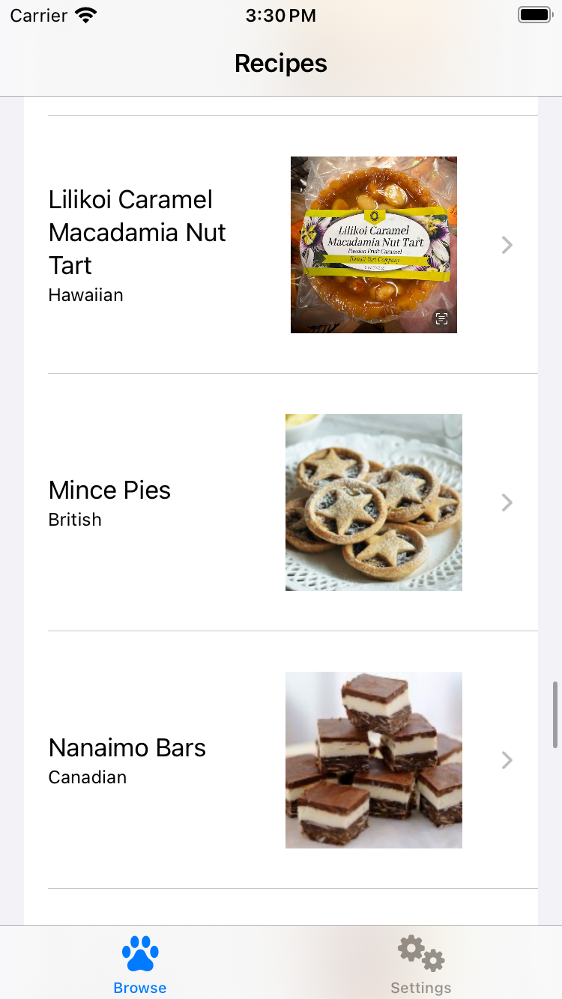
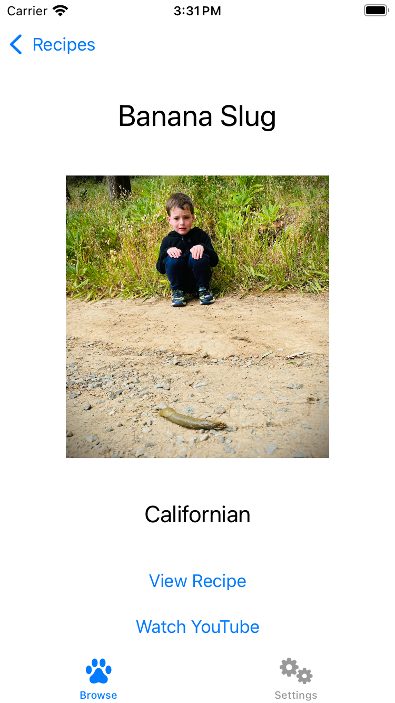
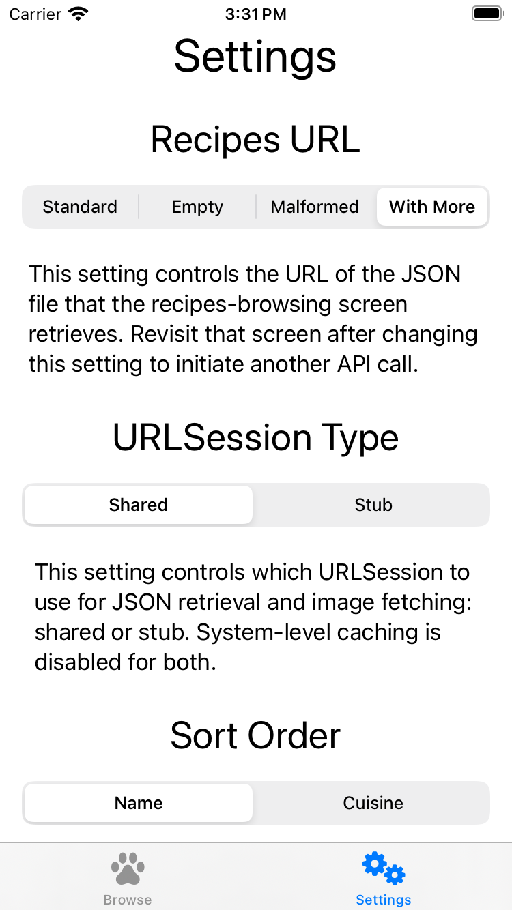

ReceFetch
===========

 

### Summary

ReceFetch is an iOS app that demonstrates knowledge of iOS development, including use of SwiftUI, Swift Testing, Swift Concurrency, and dependency injection. Users can browse recipes and get information about them from the Web and from YouTube.

Here are some screenshots.

| Browsing | Details | Settings |
| -------- | ------- | ------- |
|  |  |  |

### Focus Area

Aside from the subjects mentioned in the instructions, specifically caching, SwiftUI, and Swift Concurrency, I prioritized dependency injection. The fact that the URL is a dependency makes triggering error states easy. The fact that `URLSession` is a dependency means that unit tests can run quickly, with no reliance on the network. Use of vanilla `URLSession.shared` could be acceptable in a small app like this one but would be completely _unacceptable_ in a production app with many network calls in unit tests.

In a large production app, I would likely use a dependency-injection framework for the benefits described [here](https://www.youtube.com/watch?v=sZuI6z8qSmc). I [understand](https://www.avanderlee.com/swiftui/environment-property-wrapper/) that dependencies can live in the `Environment`, but I would hesitate to use that approach because of potential use of UIKit.

### Time Spent

I spent about twelve hours, broken out as follows:

1 hour: understanding the requirements and pondering the design

8 hours: implementing the app

2 hours: writing unit tests, time that included learning Swift Testing

1 hour: setting up the repo and writing this readme

I was fortunate to have already implemented a [similar app](https://github.com/vermont42/KatFancy). If I had not, I might have spent thirty hours. I wrote about implementing this similar app [here](https://www.racecondition.software/blog/challenges/) and [here](https://www.racecondition.software/blog/swiftui-homeworks/). The implementation of a coding-challenge app was also one subject of [iOSExpert](https://www.algoexpert.io/ios/product), a video course I created in 2023.

### Trade-Offs and Decisions

Certain features were not mentioned in the requirements and, because of real-life time constraints, I did not implement them. These include [localizable user-facing strings](https://github.com/vermont42/Conjuguer/blob/main/Conjuguer/Models/L.swift), [stylized UI](https://github.com/vermont42/RaceRunner), and [Siri support](https://www.racecondition.software/blog/siri/).

Perhaps the most unusual decision I made was to use [The World](https://www.pointfree.co/blog/posts/21-how-to-control-the-world) for dependency injection. [This post](https://www.racecondition.software/blog/dependency-injection/) contains lengthy discussions on the trade-offs of various approaches to dependency injection. In this app, I avoided method and constructor injection because I dislike the explosion of parameters that they cause, and I did not see any value to using a dependency-injection framework.

### Weakest Part of the Project

The approach to `URLSession` dependency injection involves using a singleton that prevents the unit tests from running properly in parallel. They therefore run serially. Given more time, I might use an `actor` for safe concurrent modification of the URL cache, allowing tests to run in parallel.

### Additional Information

I developed ReceFetch using Xcode 16.1, iOS 18.1, and [this song](https://youtu.be/gHFb1WFG5PU?t=3630).

Here are some credits:

[Sound Jay](https://www.soundjay.com) created the app's sounds and "[allow](https://www.soundjay.com/tos.html)[s] ... incorporat[ion of these sounds] into ... projects, be it for commercial or non-commercial use." Sound Jay "and its licensors retain all ownership rights to the sound files".

The humorous badges at the top of this readme are from my [curated list](https://github.com/vermont42/Podcasts) of iOS-development podcasts.

`Settings.swift` and the `GetterSetter` files reflect an approach to storing and retrieving settings that I developed for [Immigration](https://youtu.be/WfLCwCJ95fM?si=zvr7GzqR_UdXhmqi) and also use in [Racerunner](https://itunes.apple.com/us/app/racerunner-run-tracking-app/id1065017082) ([GitHub](https://github.com/vermont42/RaceRunner)), [Conjugar](https://itunes.apple.com/us/app/conjugar/id1236500467) ([GitHub](https://github.com/vermont42/Conjugar/)), and [Conjuguer](https://apps.apple.com/us/app/conjuguer/id1588624373) ([GitHub](https://github.com/vermont42/Conjuguer)).

`SoundPlayerReal.swift` reflects an approach to playing sounds that I developed for Immigration and also use in RaceRunner, Conjugar, and Conjuguer, though I added dependency injection to ReceFetch's implementation because playing a sound is a side effect, I realize, that is undesirable in unit tests.

[Point-Free](https://www.pointfree.co/) developed and [evangelized](https://www.pointfree.co/blog/posts/21-how-to-control-the-world) ReceFetch's approach to dependency injection, The World.

Paul Hudson [shared](https://www.hackingwithswift.com/articles/153/how-to-test-ios-networking-code-the-easy-way) the approach to dependency injection for `URLSession` used in `URLProtocolStub.swift` and `URLSessionExtension.swift`.

Donny Wals [shared](https://www.donnywals.com/using-swifts-async-await-to-build-an-image-loader/) the app's approach to image caching.

I created the app icon using Apple's [Image Playground](https://apps.apple.com/us/app/image-playground/id6479176117).
